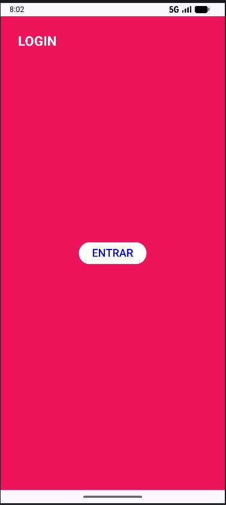
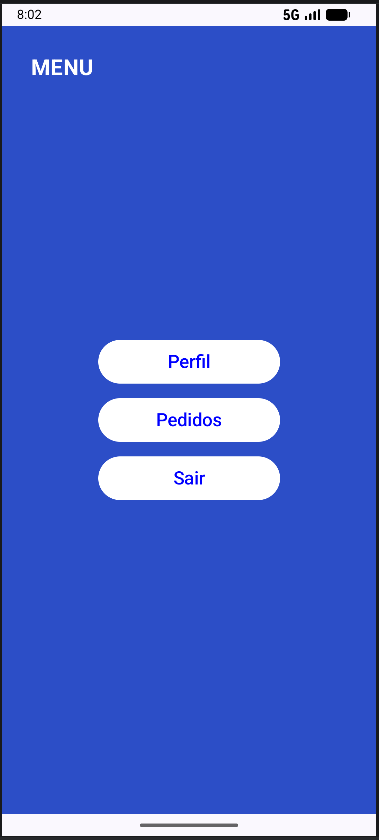
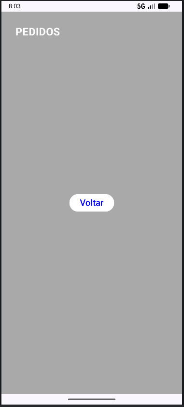
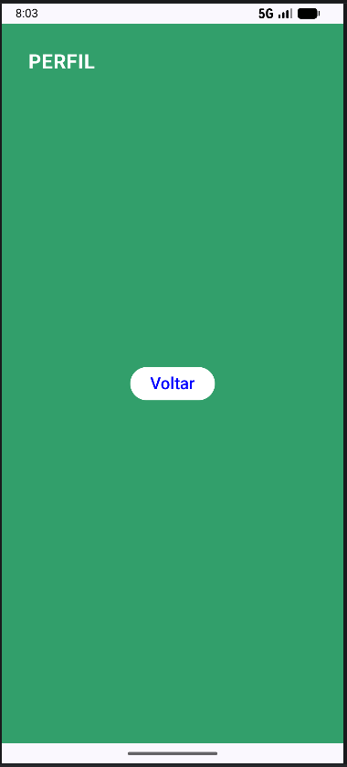

# Navigation_Trabalho_3SIS_Android

## Descrição Projeto:
(Trabalho para entrega. Projeto recriado passo a passo para compreender o fluxo de navegação e uso do NavController.)
Aplicativo Android desenvolvido com Jetpack Compose que demonstra a navegação entre telas utilizando Navigation Compose; foi utilizado como base o arquivo exercício feito em sala: https://github.com/Beatriz-3SIS-Android-Kotlin-Developer/Aula0303_Navigation-Between-Screens.git.

## O que foi utilizado/Implementado:
-Kotlin
-Jetpack Compose
-Navigation Compose
-Android Studio

## Prints das Telas do aplicativo:

### Login

### Menu

### Pedidos

### Perfil

